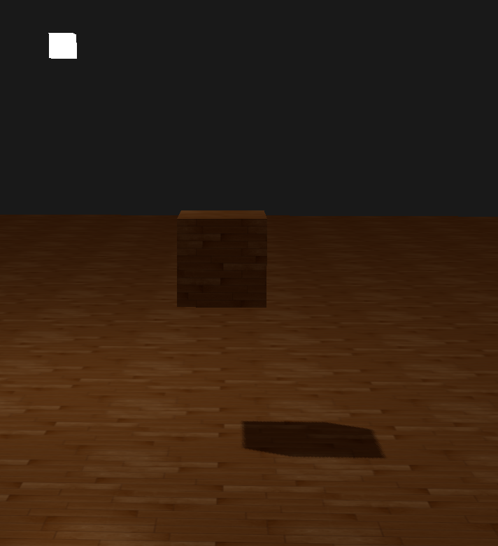
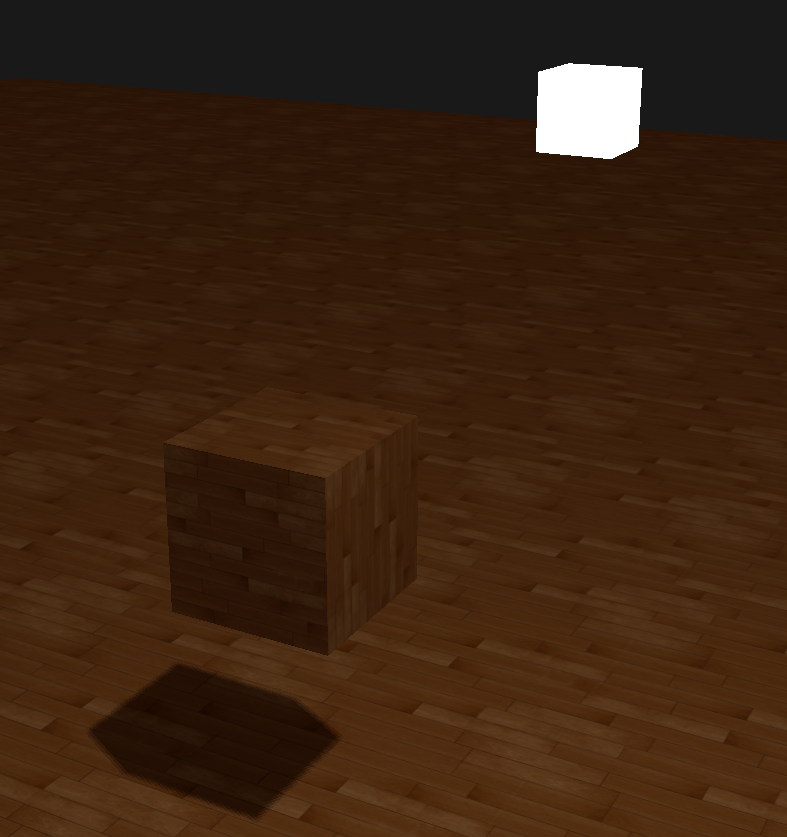
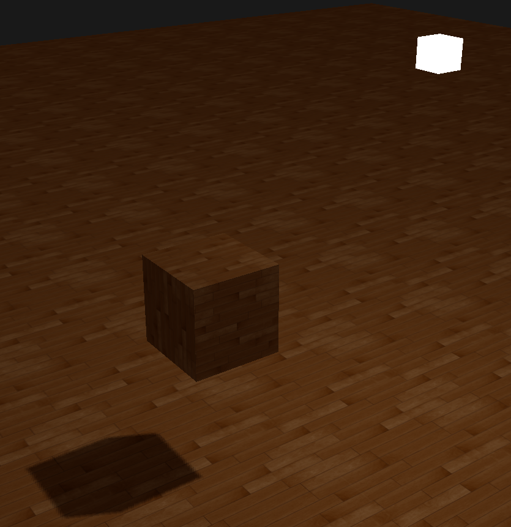
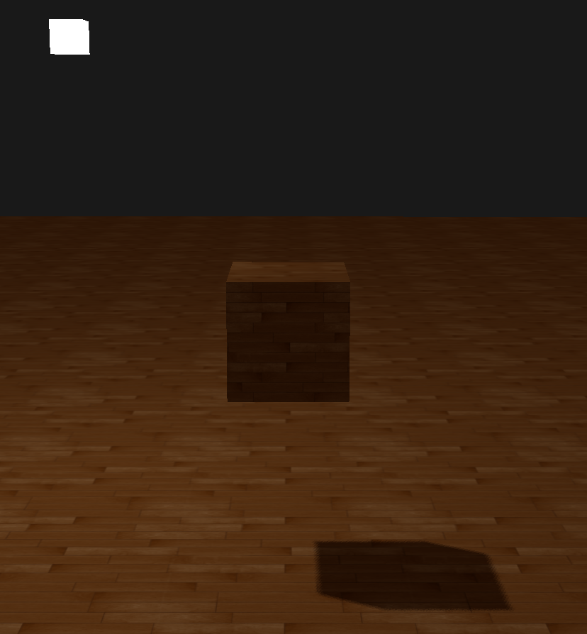
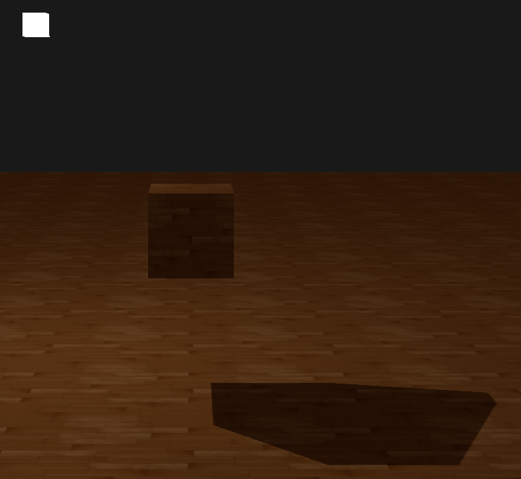

# 作业7
## 说明
- 在本题中，将鼠标改变摄像机的方式更改为了在程序中按下右键进行移动，而不是之前直接将鼠标锁定在程序中就可以直接进行移动。
- 由于报告为后写的原因，basic-1，bonus-1，bonus-2三题的代码相同，在一个文件夹中。

## Basic
### 1. 实现方向光源的Shadowing Mapping:
- 要求场景中至少有一个object和一块平面(用于显示shadow)
- 光源的投影方式任选其一即可
- 在报告里结合代码，解释Shadowing Mapping算法

#### 实现效果
实现效果如以下三张图所示。这里参考了learnopengl网站的教程和其贴图，并且将光源设置为一个正方体以便观察其位置。





#### 解释Shadowing Mapping算法
##### 生成深度贴图
在这里首先我们要生成深度贴图，深度贴图是从光的透视图里渲染的深度纹理，用它计算阴影。
- 创建一个帧缓冲对象和一个2D纹理
    ```c++
    //生成深度贴图
    const unsigned int SHADOW_WIDTH = 1024, SHADOW_HEIGHT = 1024;
    unsigned int depthMapFBO;
    glGenFramebuffers(1, &depthMapFBO);
    //创建2D纹理
    unsigned int depthMap;
    glGenTextures(1, &depthMap);
    glBindTexture(GL_TEXTURE_2D, depthMap);
    glTexImage2D(GL_TEXTURE_2D, 0, GL_DEPTH_COMPONENT, SHADOW_WIDTH, SHADOW_HEIGHT, 0, GL_DEPTH_COMPONENT, GL_FLOAT, NULL);
    glTexParameteri(GL_TEXTURE_2D, GL_TEXTURE_MIN_FILTER, GL_NEAREST);
    glTexParameteri(GL_TEXTURE_2D, GL_TEXTURE_MAG_FILTER, GL_NEAREST);
    glTexParameteri(GL_TEXTURE_2D, GL_TEXTURE_WRAP_S, GL_CLAMP_TO_BORDER);
    glTexParameteri(GL_TEXTURE_2D, GL_TEXTURE_WRAP_T, GL_CLAMP_TO_BORDER);
    float borderColor[] = { 1.0, 1.0, 1.0, 1.0 };
    glTexParameterfv(GL_TEXTURE_2D, GL_TEXTURE_BORDER_COLOR, borderColor);
    //生成的深度纹理作为帧缓冲的深度缓冲
    glBindFramebuffer(GL_FRAMEBUFFER, depthMapFBO);
    glFramebufferTexture2D(GL_FRAMEBUFFER, GL_DEPTH_ATTACHMENT, GL_TEXTURE_2D, depthMap, 0);
    glDrawBuffer(GL_NONE);
    glReadBuffer(GL_NONE);
    glBindFramebuffer(GL_FRAMEBUFFER, 0);
    ```
- 在渲染过程中生成深度贴图
    ```c++
    glViewport(0, 0, SCR_WIDTH, SCR_HEIGHT);
    glClear(GL_COLOR_BUFFER_BIT | GL_DEPTH_BUFFER_BIT);
    shader.use();
    glm::mat4 projection = glm::perspective(glm::radians(camera.Zoom), (float)SCR_WIDTH /
        (float)SCR_HEIGHT, 0.1f, 100.0f);
    glm::mat4 view = camera.GetViewMatrix();
    shader.setMat4("projection", projection);
    shader.setMat4("view", view);
    // set light uniforms
    shader.setVec3("viewPos", camera.Position);
    shader.setVec3("lightPos", lightPos);
    shader.setMat4("lightSpaceMatrix", lightSpaceMatrix);
    glActiveTexture(GL_TEXTURE0);
    glBindTexture(GL_TEXTURE_2D, woodTexture);
    glActiveTexture(GL_TEXTURE1);
    glBindTexture(GL_TEXTURE_2D, depthMap);
    renderScene(shader);
    ```
##### 光源空间的变换
默认使用的是一个所有光线都平行的定向光，我们将为光源使用正交投影矩阵，透视图将没有任何变形。为了创建一个视图矩阵来变换每个物体，把它们变换到从光源视角可见的空间中，我们将使用glm::lookAt函数；这次从光源的位置看向场景中央。二者相结合为我们提供了一个光空间的变换矩阵，它将每个世界空间坐标变换到光源处所见到的那个空间；这正是我们渲染深度贴图所需要的。这个lightSpaceMatrix正是前面我们称为T的那个变换矩阵。有了lightSpaceMatrix只要给shader提供光空间的投影和视图矩阵，我们就能像往常那样渲染场景了。
```c++
glm::mat4 lightProjection, lightView;
		glm::mat4 lightSpaceMatrix;
		float near_plane = 1.0f, far_plane = 7.5f;
		//透视投影
		//lightProjection = glm::perspective(glm::radians(45.0f), (GLfloat)SHADOW_WIDTH / (GLfloat)SHADOW_HEIGHT, near_plane, far_plane); 
		//正交投影
		lightProjection = glm::ortho(-10.0f, 10.0f, -10.0f, 10.0f, near_plane, far_plane);
		lightView = glm::lookAt(lightPos, glm::vec3(0.0f), glm::vec3(0.0, 1.0, 0.0));
		lightSpaceMatrix = lightProjection * lightView;
```
##### 渲染至深度贴图
这里的RenderScene函数的参数是一个着色器程序（shader program），它调用所有相关的绘制函数，并在需要的地方设置相应的模型矩阵。
```c++
simpleDepthShader.use();
simpleDepthShader.setMat4("lightSpaceMatrix", lightSpaceMatrix);
glViewport(0, 0, SHADOW_WIDTH, SHADOW_HEIGHT);
glBindFramebuffer(GL_FRAMEBUFFER, depthMapFBO);
glClear(GL_DEPTH_BUFFER_BIT);
glActiveTexture(GL_TEXTURE0);
glBindTexture(GL_TEXTURE_2D, woodTexture);
renderScene(simpleDepthShader);
glBindFramebuffer(GL_FRAMEBUFFER, 0);
```

##### 渲染阴影
正确地生成深度贴图以后我们就可以开始生成阴影了。这段代码在像素着色器中执行，用来检验一个片元是否在阴影之中，不过我们在顶点着色器中进行光空间的变换。

这儿的新的地方是FragPosLightSpace这个输出向量。我们用同一个lightSpaceMatrix，把世界空间顶点位置转换为光空间。顶点着色器传递一个普通的经变换的世界空间顶点位置vs_out.FragPos和一个光空间的vs_out.FragPosLightSpace给像素着色器。

像素着色器使用Blinn-Phong光照模型渲染场景。我们接着计算出一个shadow值，当fragment在阴影中时是1.0，在阴影外是0.0。然后，diffuse和specular颜色会乘以这个阴影元素。由于阴影不会是全黑的（由于散射），我们把ambient分量从乘法中剔除。

渲染阴影步骤：

- 首先要检查一个片元是否在阴影中，把光空间片元位置转换为裁切空间的标准化设备坐标。当我们在顶点着色器输出一个裁切空间顶点位置到gl_Position时，OpenGL自动进行一个透视除法，将裁切空间坐标的范围-w到w转为-1到1，这要将x、y、z元素除以向量的w元素来实现。 

- 为了作为从深度贴图中采样的坐标，xy分量也需要变换到[0,1]。所以整个projCoords向量都需要变换到[0,1]范围。

- 得到光的位置视野下最近的深度，并计算片元的当前深度

- 简单检查currentDepth是否高于closetDepth，如果是，那么片元就在阴影中。

- 顶点着色器
```glsl
#version 330 core
layout (location = 0) in vec3 aPos;
layout (location = 1) in vec3 aNormal;
layout (location = 2) in vec2 aTexCoords;

out vec2 TexCoords;

out VS_OUT {
    vec3 FragPos;
    vec3 Normal;
    vec2 TexCoords;
    vec4 FragPosLightSpace;
} vs_out;

uniform mat4 projection;
uniform mat4 view;
uniform mat4 model;
uniform mat4 lightSpaceMatrix;

void main()
{
    vs_out.FragPos = vec3(model * vec4(aPos, 1.0));
    vs_out.Normal = transpose(inverse(mat3(model))) * aNormal;
    vs_out.TexCoords = aTexCoords;
    vs_out.FragPosLightSpace = lightSpaceMatrix * vec4(vs_out.FragPos, 1.0);
    gl_Position = projection * view * model * vec4(aPos, 1.0);
}
```

- 片段着色器
```glsl
#version 330 core
out vec4 FragColor;

in VS_OUT {
    vec3 FragPos;
    vec3 Normal;
    vec2 TexCoords;
    vec4 FragPosLightSpace;
} fs_in;

uniform sampler2D diffuseTexture;
uniform sampler2D shadowMap;

uniform vec3 lightPos;
uniform vec3 viewPos;

float ShadowCalculation(vec4 fragPosLightSpace)
{
    // 透视除法
    vec3 projCoords = fragPosLightSpace.xyz / fragPosLightSpace.w;
    // 变换到[0,1]的范围
    projCoords = projCoords * 0.5 + 0.5;
    // 取得最近点的深度
    float closestDepth = texture(shadowMap, projCoords.xy).r;
    // 取得当前片元在光源视角下的深度
    float currentDepth = projCoords.z;
    // 阴影偏移
    vec3 normal = normalize(fs_in.Normal);
    vec3 lightDir = normalize(lightPos - fs_in.FragPos);
    float bias = max(0.05 * (1.0 - dot(normal, lightDir)), 0.005);
    // 检查当前片元是否在阴影中
    // float shadow = currentDepth - bias > closestDepth  ? 1.0 : 0.0;
    // PCF
    float shadow = 0.0;
    vec2 texelSize = 1.0 / textureSize(shadowMap, 0);
    for(int x = -1; x <= 1; ++x)
    {
        for(int y = -1; y <= 1; ++y)
        {
            float pcfDepth = texture(shadowMap, projCoords.xy + vec2(x, y) * texelSize).r;
            shadow += currentDepth - bias > pcfDepth  ? 1.0 : 0.0;
        }
    }
    shadow /= 9.0;
    
    if(projCoords.z > 1.0)
        shadow = 0.0;
    
    return shadow;
}

void main()
{
    vec3 color = texture(diffuseTexture, fs_in.TexCoords).rgb;
    vec3 normal = normalize(fs_in.Normal);
    vec3 lightColor = vec3(0.3);
    // ambient
    vec3 ambient = 0.3 * color;
    // diffuse
    vec3 lightDir = normalize(lightPos - fs_in.FragPos);
    float diff = max(dot(lightDir, normal), 0.0);
    vec3 diffuse = diff * lightColor;
    // specular
    vec3 viewDir = normalize(viewPos - fs_in.FragPos);
    vec3 reflectDir = reflect(-lightDir, normal);
    float spec = 0.0;
    vec3 halfwayDir = normalize(lightDir + viewDir);
    spec = pow(max(dot(normal, halfwayDir), 0.0), 64.0);
    vec3 specular = spec * lightColor;
    // calculate shadow
    float shadow = ShadowCalculation(fs_in.FragPosLightSpace);
    vec3 lighting = (ambient + (1.0 - shadow) * (diffuse + specular)) * color;
    
    FragColor = vec4(lighting, 1.0);
}
```

### 2. 修改GUI

## Bonus:
### 1. 实现光源在正交/透视两种投影下的Shadowing Mapping
在渲染深度贴图的时候，正交(Orthographic)和投影(Projection)矩阵之间有所不同。正交投影矩阵并不会将场景用透视图进行变形，所有视线/光线都是平行的，这使它对于定向光来说是个很好的投影矩阵。然而透视投影矩阵，会将所有顶点根据透视关系进行变形，结果因此而不同，如下所示。
- 正交

- 透视


### 2. 优化Shadowing Mapping (可结合References链接，或其他方法。优化方式越多越好，在报告里说明，有加分

#### 悬浮
使用阴影偏移的一个缺点是你对物体的实际深度应用了平移。偏移有可能足够大，以至于可以看出阴影相对实际物体位置的偏移，这个阴影失真叫做悬浮(Peter Panning)，因为物体看起来轻轻悬浮在表面之上（译注Peter Pan就是童话彼得潘，而panning有平移、悬浮之意，而且彼得潘是个会飞的男孩…）。我们可以使用一个叫技巧解决大部分的Peter panning问题：当渲染深度贴图时候使用正面剔除（front face culling）你也许记得在面剔除教程中OpenGL默认是背面剔除。我们要告诉OpenGL我们要剔除正面。
``` c++
glCullFace(GL_FRONT);
renderScene(simpleDepthShader);
glBindFramebuffer(GL_FRAMEBUFFER, 0);
glCullFace(GL_BACK);
```

#### 采样过多
我们宁可让所有超出深度贴图的坐标的深度范围是1.0，这样超出的坐标将永远不在阴影之中。我们可以储存一个边框颜色，然后把深度贴图的纹理环绕选项设置为GL_CLAMP_TO_BORDER：

- main.cpp
    ```c++
    glTexParameteri(GL_TEXTURE_2D, GL_TEXTURE_WRAP_S, GL_CLAMP_TO_BORDER);
    glTexParameteri(GL_TEXTURE_2D, GL_TEXTURE_WRAP_T, GL_CLAMP_TO_BORDER);
    GLfloat borderColor[] = { 1.0, 1.0, 1.0, 1.0 };
    glTexParameterfv(GL_TEXTURE_2D, GL_TEXTURE_BORDER_COLOR, borderColor);
    ```
当一个点比光的远平面还要远时，它的投影坐标的z坐标大于1.0。这种情况下，GL_CLAMP_TO_BORDER环绕方式不起作用，因为我们把坐标的z元素和深度贴图的值进行了对比；它总是为大于1.0的z返回true。

解决这个问题也很简单，只要投影向量的z坐标大于1.0，我们就把shadow的值强制设为0.0
- cube.fs
    ```glsl
    // keep the shadow at 0.0 when outside the far_plane region of the light's frustum.
    if(projCoords.z > 1.0)
        shadow = 0.0;
    ```

#### PCF
如果你放大看阴影，阴影映射对解析度的依赖很快变得很明显。PCF（percentage-closer filtering），这是一种多个不同过滤方式的组合，它产生柔和阴影，使它们出现更少的锯齿块和硬边。核心思想是从深度贴图中多次采样，每一次采样的纹理坐标都稍有不同。每个独立的样本可能在也可能不再阴影中。所有的次生结果接着结合在一起，进行平均化，我们就得到了柔和阴影。

一个简单的PCF的实现是简单的从纹理像素四周对深度贴图采样，然后把结果平均起来：
- cube.fs
    ```glsl
    // PCF
    float shadow = 0.0;
    vec2 texelSize = 1.0 / textureSize(shadowMap, 0);
    for(int x = -1; x <= 1; ++x)
    {
        for(int y = -1; y <= 1; ++y)
        {
            float pcfDepth = texture(shadowMap, projCoords.xy + vec2(x, y) * texelSize).r;
            shadow += currentDepth - bias > pcfDepth  ? 1.0 : 0.0;
        }
    }
    shadow /= 9.0;
    ```